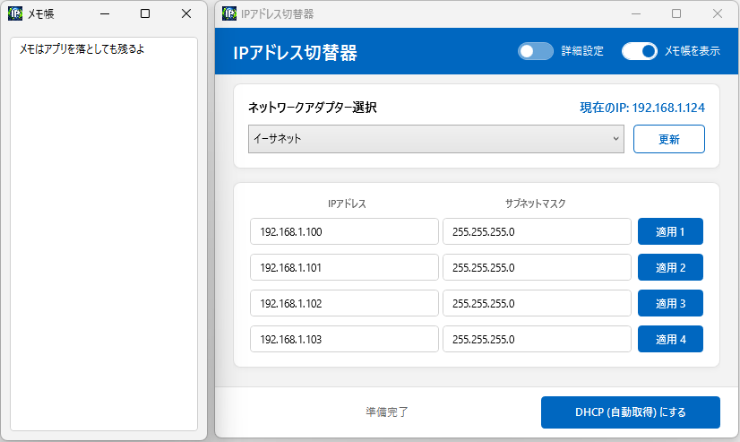

# IPアドレス切替器

[](https://opensource.org/licenses/MIT)
[](https://dotnet.microsoft.com/download/dotnet/8.0)

**IPアドレス切替器** は、Windowsのネットワーク設定（IPアドレス、サブネットマスク、ゲートウェイ、DNS）を素早く、簡単に切り替えるためのオープンソースツールです。

社内ネットワーク、客先ネットワーク、開発環境など、ネットワーク設定を頻繁に切り替えるエンジニアやIT管理者に最適です。



## 🚀 主な機能

* **複数の設定パターン保存**: 最大4つまでのネットワーク設定を保存し、ボタン一つで切り替え可能。
* **DHCP切り替え**: ワンクリックでIPアドレスとDNSを自動取得（DHCP）にリセット。
* **詳細設定モード**: ゲートウェイやDNSの設定を必要に応じて表示・非表示に切り替え可能。
* **アダプター選択**: PCに搭載されている有効なネットワークアダプターを自動検出し、対象を選択可能。
* **メモ機能**: 設定内容や用途を記録しておける便利なサイドメモウィンドウを搭載。
* **設定の自動保存**: 入力した内容は自動的に保存され、次回の起動時にも保持されます。
* **モダンなUI**: 直感的で使いやすいWPFベースのデザイン。

## 📋 動作要件

* **OS**: Windows 10 / 11 (64bit推奨)
* **ランタイム**: [.NET 8.0 Desktop Runtime](https://dotnet.microsoft.com/download/dotnet/8.0)
* **権限**: ネットワーク設定を変更するため、**管理者権限**が必要です。

## 🛠 使い方

1. `IPchanger.exe` を実行します（ネットワーク設定変更のため、管理者として実行されます）。
2. 上部のドロップダウンから、設定を変更したい「ネットワークアダプター」を選択します。
3. 切り替えたいIPアドレス、サブネットマスク等を入力します（「詳細設定」ボタンでゲートウェイとDNSの入力欄が表示されます）。
4. 「適用」ボタンをクリックすると、設定が反映されます。
5. 「DHCP (自動取得) にする」ボタンを押すと、すべての設定が自動取得に戻ります。

## 📦 インストール / 開発

### ビルド方法

1. [Visual Studio 2022](https://visualstudio.microsoft.com/ja/vs/) または [.NET 8 SDK](https://dotnet.microsoft.com/download/dotnet/8.0) をインストールします。
2. リポジトリをクローンします。

```bash
   git clone https://github.com/OtabiHirohito/IPchanger.git
   ```

3. ソリューションファイル `IPchanger.sln` を開いてビルドするか、コマンドラインで以下を実行します。

```bash
   dotnet build
   ```

## 📄 ライセンス

このプロジェクトは **MITライセンス** のもとで公開されています。詳細は [LICENSE.txt](LICENSE.txt) をご覧ください。

---

Created by \[Otabi Hirohito]

