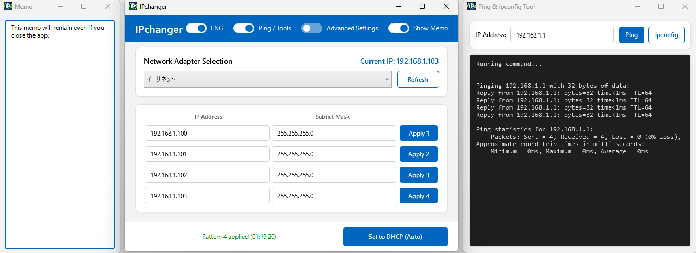

# IPchanger

[](https://opensource.org/licenses/MIT)
[](https://dotnet.microsoft.com/download/dotnet/8.0)

[Japanese README is available here](README.md)

**IPchanger** is an open-source Windows application designed to quickly and easily switch network settings (IP address, subnet mask, gateway, DNS).

It is ideal for engineers and IT administrators who frequently switch network configurations between corporate networks, client sites, and development environments.



## 🚀 Key Features

* **Save Multiple Setting Patterns**: Save up to 4 network configurations and switch between them with a single click.
* **DHCP Switching**: Reset IP address and DNS settings to automatic acquisition (DHCP) with one click.
* **Advanced Settings Mode**: Show or hide Gateway and DNS fields as needed.
* **Adapter Selection**: Automatically detect and select active network adapters on your PC.
* **Side Memo Function**: Built-in side memo window to keep notes and usage records.
* **Ping / ipconfig Tools**: Built-in side window to execute Ping commands against specified IP addresses and view `ipconfig` network details.
* **Auto-Save Settings**: Configured settings are saved automatically and retained across restarts.
* **Multi-Language Support**: Easily switch between English and Japanese.
* **Modern UI**: Intuitive and easy-to-use WPF-based interface.

## 📋 System Requirements

* **OS**: Windows 10 / 11 (64-bit recommended)
* **Runtime**: [.NET 8.0 Desktop Runtime](https://dotnet.microsoft.com/download/dotnet/8.0)
* **Permissions**: **Administrator privileges** are required to modify network settings.

## 🛠 How to Use

1. Run `IPchanger.exe` (executes as Administrator to change network settings).
2. Select the target Network Adapter from the top drop-down list.
3. Enter the desired IP address, subnet mask, etc. (Click "Advanced Settings" toggle button to display Gateway and DNS input fields).
4. Click the "Apply" button to apply the settings.
5. Click the "Set to DHCP (Auto)" button to reset all settings to automatic acquisition.
6. Toggle the "Ping / Tools" switch in the top header to open the window for executing Ping commands and viewing `ipconfig` output.

## 📦 Installation / Development

 ### Installation

1. Download `IPchanger.zip` from the link below:

   [Download IPchanger.zip](https://github.com/OtabiHirohito/IPchanger/releases)

2. Extract the downloaded ZIP file to any directory.
3. Run `IPchanger.exe` inside the extracted folder.
4. Make sure to run with Administrator privileges.

 ### Building from Source

1. Install [Visual Studio 2022](https://visualstudio.microsoft.com/) or [.NET 8 SDK](https://dotnet.microsoft.com/download/dotnet/8.0).
2. Clone the repository:

   ```bash
   git clone https://github.com/OtabiHirohito/IPchanger.git
   ```

3. Open `IPchanger.sln` in Visual Studio to build, or run the following CLI command:

   ```bash
   dotnet build
   ```

## 🤝 Donations

If you find this software useful, please consider supporting the following organizations:
<sub>*The software and creator are not affiliated with these organizations.*</sub>

* [Donation 1](https://donate.jrc.or.jp/ "Japanese Red Cross Society")
* [Donation 2](https://www.doubutukikin.or.jp/legal/business/ "Doubutukikin")

## 📄 License

This project is released under the **MIT License**. See [LICENSE.txt](LICENSE.txt) for details.

---

Created by Hirohito Otabi / X (Twitter): [@OtabiHirohito](https://x.com/OtabiHirohito)
